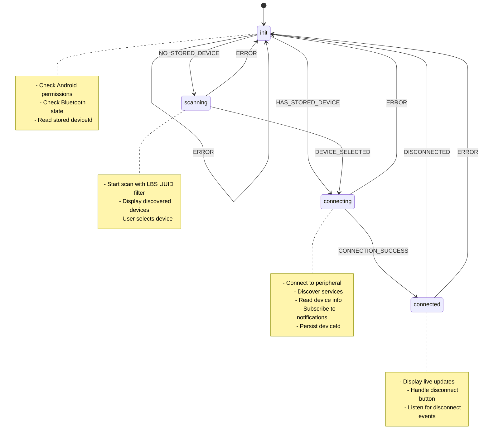

# React Native BLE with XState v5

A production-ready demo showcasing **Bluetooth Low Energy (BLE)** device management in React Native using **XState v5** for predictable state management. Built with Expo (Android-focused) and tested against a Nordic LED Button Service (LBS) peripheral.

---

## Table of Contents

1. [Why XState for BLE?](#why-xstate-for-ble)
2. [Architecture Overview](#architecture-overview)
3. [Prerequisites](#prerequisites)
4. [Project Setup](#project-setup)
5. [Folder Structure](#folder-structure)
6. [Android Permissions](#android-permissions)
7. [The BLE State Machine](#the-ble-state-machine)
8. [Implementation](#implementation)
9. [Setting Up the iOS Peripheral](#setting-up-the-ios-peripheral)
10. [Running the App](#running-the-app)
11. [Troubleshooting](#troubleshooting)
12. [Acceptance Checklist](#acceptance-checklist)
13. [Copy/Paste Checklist](#copypaste-checklist)

---

## Why XState for BLE?

BLE flows are inherently **stateful and asynchronous**. A typical connection flow involves:

- Permission checks
- Bluetooth adapter state verification
- Device scanning
- Connection establishment
- Service discovery
- Characteristic reads/writes/subscriptions
- Graceful disconnection handling

**Problems with ad-hoc state management:**

| Issue | Description |
|-------|-------------|
| Race conditions | User taps "Connect" while scan is stopping |
| Impossible states | UI shows "Connected" but device is null |
| Error recovery | Where do we go after a connection timeout? |
| Testing | How do you unit test a `useState` + `useEffect` spaghetti? |

**XState solves these by:**

- ✅ Making states **explicit** and **finite** (init, scanning, connecting, connected)
- ✅ Defining **allowed transitions** — no more impossible states
- ✅ Handling **async operations** via invoked actors/services
- ✅ Providing **built-in error handling** with automatic transitions
- ✅ Enabling **visual debugging** and **test generation**

---

## Architecture Overview

```
┌─────────────────────────────────────────────────────────────┐
│                      React Native UI                        │
│  ┌─────────────────┐  ┌─────────────────────────────────┐  │
│  │  Device List    │  │       Start Button              │  │
│  │  (Top 50%)      │  │       Disconnect Button         │  │
│  └─────────────────┘  └─────────────────────────────────┘  │
│  ┌─────────────────────────────────────────────────────────┐│
│  │                    Log Panel (Bottom 50%)               ││
│  │  [12:00:01] State: init → scanning                      ││
│  │  [12:00:02] Peripheral discovered: Nordic_LBS           ││
│  └─────────────────────────────────────────────────────────┘│
└─────────────────────────────────────────────────────────────┘
                              │
                              ▼
┌─────────────────────────────────────────────────────────────┐
│                    XState Machine                           │
│  ┌──────┐    ┌──────────┐    ┌────────────┐    ┌─────────┐ │
│  │ init │───▶│ scanning │───▶│ connecting │───▶│connected│ │
│  └──────┘    └──────────┘    └────────────┘    └─────────┘ │
│      ▲                                              │       │
│      └──────────────── ERROR ───────────────────────┘       │
└─────────────────────────────────────────────────────────────┘
                              │
                              ▼
┌─────────────────────────────────────────────────────────────┐
│               react-native-ble-manager                      │
│  NativeEventEmitter: BleManagerDidUpdateState,              │
│  BleManagerDiscoverPeripheral, BleManagerStopScan,          │
│  BleManagerDisconnectPeripheral, BleManagerDidUpdateValue   │
└─────────────────────────────────────────────────────────────┘
```

---

## Prerequisites

- **Node.js** 18+ and npm/yarn
- **Android Studio** with SDK 31+ (for Android 12+ BLE permissions)
- **Physical Android device** (BLE doesn't work on emulators)
- **macOS with Xcode** (to run the iOS peripheral simulator)
- **iOS device or Simulator** (to run the peripheral — Simulator works for peripheral role)

---

## Project Setup

### Step 1: Create Expo Project

```bash
npx create-expo-app@latest XstateWithBLE --template blank-typescript
cd XstateWithBLE
```

### Step 2: Install Dependencies

```bash
# BLE library
npm install react-native-ble-manager

# XState v5
npm install xstate @xstate/react

# AsyncStorage for persisting device ID
npm install @react-native-async-storage/async-storage

# Expo dev client (required for native modules)
npx expo install expo-dev-client
```

### Step 3: Prebuild for Native Modules

> ⚠️ **Important**: `react-native-ble-manager` contains native code. You **cannot** use Expo Go. You must use a development build.

```bash
# Generate native android/ and ios/ folders
npx expo prebuild --platform android

# Or for both platforms
npx expo prebuild
```

### Step 4: Configure Android Permissions

Add to `android/app/src/main/AndroidManifest.xml` (after prebuild):

```xml
<!-- Inside <manifest> tag, before <application> -->
<uses-permission android:name="android.permission.BLUETOOTH" android:maxSdkVersion="30" />
<uses-permission android:name="android.permission.BLUETOOTH_ADMIN" android:maxSdkVersion="30" />

<!-- Android 12+ (API 31+) -->
<uses-permission android:name="android.permission.BLUETOOTH_SCAN" android:usesPermissionFlags="neverForLocation" />
<uses-permission android:name="android.permission.BLUETOOTH_CONNECT" />

<!-- Required for BLE scanning on Android 11 and below -->
<uses-permission android:name="android.permission.ACCESS_FINE_LOCATION" />

<!-- Declare BLE feature -->
<uses-feature android:name="android.hardware.bluetooth_le" android:required="true" />
```

### Step 5: Run Development Build

```bash
# Build and run on connected Android device
npx expo run:android

# Or use EAS Build for cloud builds
npx eas build --profile development --platform android
```

---

## Folder Structure

```
XstateWithBLE/
├── src/
│   ├── ble/
│   │   ├── bleMachine.ts        # XState v5 machine definition
│   │   ├── bleService.ts        # BLE operations wrapper
│   │   ├── bleEvents.ts         # Event listener setup
│   │   └── constants.ts         # UUIDs and constants
│   ├── components/
│   │   ├── DeviceList.tsx       # Scanned devices list
│   │   ├── LogPanel.tsx         # Timestamped log viewer
│   │   └── ConnectionInfo.tsx   # Connected device info
│   ├── hooks/
│   │   └── useBLEMachine.ts     # Custom hook wrapping the machine
│   ├── storage/
│   │   └── deviceStorage.ts     # AsyncStorage helpers
│   └── types/
│       └── index.ts             # TypeScript types
├── App.tsx                      # Main screen
├── app.json
├── package.json
└── tsconfig.json
```

---

## Android Permissions

### Runtime Permission Strategy

Android 12+ (API 31+) introduced new BLE permissions that must be requested at runtime:

| Permission | Purpose | Required API Level |
|------------|---------|-------------------|
| `BLUETOOTH_SCAN` | Discover nearby devices | 31+ |
| `BLUETOOTH_CONNECT` | Connect to paired devices | 31+ |
| `ACCESS_FINE_LOCATION` | BLE scanning (legacy) | < 31 |

### Permission Flow in Init State

```typescript
// Simplified permission check logic
const checkPermissions = async (): Promise<boolean> => {
  if (Platform.OS === 'android') {
    const apiLevel = Platform.Version;
    
    if (apiLevel >= 31) {
      // Android 12+
      const scanGranted = await PermissionsAndroid.request(
        PermissionsAndroid.PERMISSIONS.BLUETOOTH_SCAN
      );
      const connectGranted = await PermissionsAndroid.request(
        PermissionsAndroid.PERMISSIONS.BLUETOOTH_CONNECT
      );
      return scanGranted === 'granted' && connectGranted === 'granted';
    } else {
      // Android 11 and below
      const locationGranted = await PermissionsAndroid.request(
        PermissionsAndroid.PERMISSIONS.ACCESS_FINE_LOCATION
      );
      return locationGranted === 'granted';
    }
  }
  return true; // iOS handles permissions via Info.plist
};
```

---

## The BLE State Machine

### State Diagram (Mermaid)



### Visual Representation

```
                    ┌─────────────────────────────────────┐
                    │                                     │
                    ▼                                     │
              ┌──────────┐                                │
     ┌───────▶│   init   │◀───────────────────────┐      │
     │        └──────────┘                        │      │
     │              │                             │      │
     │    ┌─────────┴─────────┐                   │      │
     │    ▼                   ▼                   │      │
     │  NO_STORED         HAS_STORED              │      │
     │  _DEVICE           _DEVICE                 │      │
     │    │                   │                   │      │
     │    ▼                   │                   │      │
     │ ┌──────────┐           │                   │      │
     │ │ scanning │           │                   │      │
     │ └──────────┘           │                   │      │
     │       │                │                   │      │
     │  DEVICE_SELECTED       │                   │      │
     │       │                │                   │      │
     │       ▼                ▼                   │      │
     │    ┌────────────────────┐                  │      │
     │    │    connecting      │──── ERROR ───────┘      │
     │    └────────────────────┘                         │
     │              │                                    │
     │    CONNECTION_SUCCESS                             │
     │              │                                    │
     │              ▼                                    │
     │    ┌────────────────────┐                         │
     └────│     connected      │─── DISCONNECTED ────────┘
   ERROR  └────────────────────┘
```

---

## Implementation

### `src/types/index.ts`

```typescript
// src/types/index.ts

export interface Peripheral {
  id: string;
  name: string | null;
  rssi: number;
  advertising: {
    serviceUUIDs?: string[];
    localName?: string;
    manufacturerData?: any;
  };
}

export interface LogEntry {
  id: string;
  timestamp: Date;
  message: string;
  type: 'state' | 'event' | 'error' | 'info';
}

export interface DeviceInfo {
  serialNumber?: string;
  batteryLevel?: number;
  firmwareRevision?: string;
  modelNumber?: string;
}

export interface BLEContext {
  connectedDeviceId: string | null;
  selectedDeviceId: string | null;
  peripherals: Map<string, Peripheral>;
  logs: LogEntry[];
  error: string | null;
  deviceInfo: DeviceInfo | null;
  buttonState: boolean;
}

// XState v5 typed events
export type BLEEvent =
  | { type: 'START' }
  | { type: 'STOP' }
  | { type: 'NO_STORED_DEVICE' }
  | { type: 'HAS_STORED_DEVICE'; deviceId: string }
  | { type: 'PERIPHERAL_DISCOVERED'; peripheral: Peripheral }
  | { type: 'DEVICE_SELECTED'; deviceId: string }
  | { type: 'CONNECTION_SUCCESS'; deviceInfo: DeviceInfo }
  | { type: 'DISCONNECTED' }
  | { type: 'BUTTON_UPDATE'; pressed: boolean }
  | { type: 'ERROR'; message: string }
  | { type: 'LOG'; message: string; logType: LogEntry['type'] };
```

### `src/ble/constants.ts`

```typescript
// src/ble/constants.ts

// Nordic LED Button Service (LBS) UUIDs
// Reference: https://docs.nordicsemi.com/bundle/ncs-latest/page/nrf/libraries/bluetooth/services/lbs.html

export const NORDIC_LBS = {
  SERVICE_UUID: '00001523-1212-efde-1523-785feabcd123',
  BUTTON_CHAR_UUID: '00001524-1212-efde-1523-785feabcd123', // Notify
  LED_CHAR_UUID: '00001525-1212-efde-1523-785feabcd123',    // Write
} as const;

// Standard BLE Service UUIDs
export const STANDARD_SERVICES = {
  DEVICE_INFORMATION: '180a',
  BATTERY_SERVICE: '180f',
} as const;

// Standard Characteristic UUIDs
export const STANDARD_CHARACTERISTICS = {
  SERIAL_NUMBER: '2a25',
  MODEL_NUMBER: '2a24',
  FIRMWARE_REVISION: '2a26',
  BATTERY_LEVEL: '2a19',
} as const;

// Scan duration in seconds
export const SCAN_DURATION = 10;

// AsyncStorage keys
export const STORAGE_KEYS = {
  CONNECTED_DEVICE_ID: '@ble/connected_device_id',
} as const;
```

### `src/storage/deviceStorage.ts`

```typescript
// src/storage/deviceStorage.ts

import AsyncStorage from '@react-native-async-storage/async-storage';
import { STORAGE_KEYS } from '../ble/constants';

export const deviceStorage = {
  async getConnectedDeviceId(): Promise<string | null> {
    try {
      return await AsyncStorage.getItem(STORAGE_KEYS.CONNECTED_DEVICE_ID);
    } catch (error) {
      console.error('Failed to get connected device ID:', error);
      return null;
    }
  },

  async setConnectedDeviceId(deviceId: string): Promise<void> {
    try {
      await AsyncStorage.setItem(STORAGE_KEYS.CONNECTED_DEVICE_ID, deviceId);
    } catch (error) {
      console.error('Failed to set connected device ID:', error);
    }
  },

  async clearConnectedDeviceId(): Promise<void> {
    try {
      await AsyncStorage.removeItem(STORAGE_KEYS.CONNECTED_DEVICE_ID);
    } catch (error) {
      console.error('Failed to clear connected device ID:', error);
    }
  },
};
```

### `src/ble/bleService.ts`

```typescript
// src/ble/bleService.ts

import { Platform, PermissionsAndroid } from 'react-native';
import BleManager from 'react-native-ble-manager';
import {
  NORDIC_LBS,
  STANDARD_SERVICES,
  STANDARD_CHARACTERISTICS,
  SCAN_DURATION,
} from './constants';
import type { DeviceInfo } from '../types';

class BLEService {
  private isInitialized = false;

  async initialize(): Promise<void> {
    if (this.isInitialized) return;

    await BleManager.start({ showAlert: false });
    this.isInitialized = true;
  }

  async checkPermissions(): Promise<boolean> {
    if (Platform.OS === 'ios') {
      return true;
    }

    const apiLevel = Platform.Version as number;

    try {
      if (apiLevel >= 31) {
        // Android 12+
        const scanResult = await PermissionsAndroid.request(
          PermissionsAndroid.PERMISSIONS.BLUETOOTH_SCAN,
          {
            title: 'Bluetooth Scan Permission',
            message: 'This app needs Bluetooth scan permission to find BLE devices.',
            buttonNeutral: 'Ask Me Later',
            buttonNegative: 'Cancel',
            buttonPositive: 'OK',
          }
        );

        const connectResult = await PermissionsAndroid.request(
          PermissionsAndroid.PERMISSIONS.BLUETOOTH_CONNECT,
          {
            title: 'Bluetooth Connect Permission',
            message: 'This app needs Bluetooth connect permission to communicate with BLE devices.',
            buttonNeutral: 'Ask Me Later',
            buttonNegative: 'Cancel',
            buttonPositive: 'OK',
          }
        );

        return (
          scanResult === PermissionsAndroid.RESULTS.GRANTED &&
          connectResult === PermissionsAndroid.RESULTS.GRANTED
        );
      } else {
        // Android 11 and below
        const locationResult = await PermissionsAndroid.request(
          PermissionsAndroid.PERMISSIONS.ACCESS_FINE_LOCATION,
          {
            title: 'Location Permission',
            message: 'This app needs location permission to scan for BLE devices.',
            buttonNeutral: 'Ask Me Later',
            buttonNegative: 'Cancel',
            buttonPositive: 'OK',
          }
        );

        return locationResult === PermissionsAndroid.RESULTS.GRANTED;
      }
    } catch (error) {
      console.error('Permission request error:', error);
      return false;
    }
  }

  async checkBluetoothState(): Promise<boolean> {
    try {
      await BleManager.enableBluetooth();
      return true;
    } catch (error) {
      console.error('Bluetooth not enabled:', error);
      return false;
    }
  }

  async startScan(): Promise<void> {
    await BleManager.scan([NORDIC_LBS.SERVICE_UUID], SCAN_DURATION, false, {
      matchMode: 1, // MATCH_MODE_AGGRESSIVE
      scanMode: 1,  // SCAN_MODE_LOW_LATENCY
      callbackType: 1, // CALLBACK_TYPE_ALL_MATCHES
    });
  }

  async stopScan(): Promise<void> {
    try {
      await BleManager.stopScan();
    } catch (error) {
      console.log('Stop scan error (may already be stopped):', error);
    }
  }

  async connect(peripheralId: string): Promise<void> {
    await BleManager.connect(peripheralId);
  }

  async disconnect(peripheralId: string): Promise<void> {
    try {
      await BleManager.disconnect(peripheralId);
    } catch (error) {
      console.log('Disconnect error:', error);
    }
  }

  async discoverServices(peripheralId: string): Promise<void> {
    await BleManager.retrieveServices(peripheralId);
  }

  async readDeviceInfo(peripheralId: string): Promise<DeviceInfo> {
    const deviceInfo: DeviceInfo = {};

    try {
      // Read serial number
      const serialData = await BleManager.read(
        peripheralId,
        STANDARD_SERVICES.DEVICE_INFORMATION,
        STANDARD_CHARACTERISTICS.SERIAL_NUMBER
      );
      deviceInfo.serialNumber = String.fromCharCode(...serialData);
    } catch (e) {
      console.log('Serial number not available');
    }

    try {
      // Read battery level
      const batteryData = await BleManager.read(
        peripheralId,
        STANDARD_SERVICES.BATTERY_SERVICE,
        STANDARD_CHARACTERISTICS.BATTERY_LEVEL
      );
      deviceInfo.batteryLevel = batteryData[0];
    } catch (e) {
      console.log('Battery level not available');
    }

    try {
      // Read model number
      const modelData = await BleManager.read(
        peripheralId,
        STANDARD_SERVICES.DEVICE_INFORMATION,
        STANDARD_CHARACTERISTICS.MODEL_NUMBER
      );
      deviceInfo.modelNumber = String.fromCharCode(...modelData);
    } catch (e) {
      console.log('Model number not available');
    }

    try {
      // Read firmware revision
      const firmwareData = await BleManager.read(
        peripheralId,
        STANDARD_SERVICES.DEVICE_INFORMATION,
        STANDARD_CHARACTERISTICS.FIRMWARE_REVISION
      );
      deviceInfo.firmwareRevision = String.fromCharCode(...firmwareData);
    } catch (e) {
      console.log('Firmware revision not available');
    }

    return deviceInfo;
  }

  async subscribeToButtonNotifications(peripheralId: string): Promise<void> {
    await BleManager.startNotification(
      peripheralId,
      NORDIC_LBS.SERVICE_UUID,
      NORDIC_LBS.BUTTON_CHAR_UUID
    );
  }

  async unsubscribeFromButtonNotifications(peripheralId: string): Promise<void> {
    try {
      await BleManager.stopNotification(
        peripheralId,
        NORDIC_LBS.SERVICE_UUID,
        NORDIC_LBS.BUTTON_CHAR_UUID
      );
    } catch (error) {
      console.log('Unsubscribe error:', error);
    }
  }

  async writeLED(peripheralId: string, on: boolean): Promise<void> {
    await BleManager.write(
      peripheralId,
      NORDIC_LBS.SERVICE_UUID,
      NORDIC_LBS.LED_CHAR_UUID,
      [on ? 1 : 0]
    );
  }
}

export const bleService = new BLEService();
```

### `src/ble/bleEvents.ts`

```typescript
// src/ble/bleEvents.ts

import { NativeModules, NativeEventEmitter } from 'react-native';
import BleManager from 'react-native-ble-manager';
import type { Peripheral } from '../types';
import { NORDIC_LBS } from './constants';

const BleManagerModule = NativeModules.BleManager;
const bleEmitter = new NativeEventEmitter(BleManagerModule);

// Official react-native-ble-manager event names
// Reference: https://github.com/innoveit/react-native-ble-manager#events
export const BLE_EVENTS = {
  DISCOVER_PERIPHERAL: 'BleManagerDiscoverPeripheral',
  STOP_SCAN: 'BleManagerStopScan',
  DISCONNECT_PERIPHERAL: 'BleManagerDisconnectPeripheral',
  UPDATE_VALUE: 'BleManagerDidUpdateValueForCharacteristic',
  UPDATE_STATE: 'BleManagerDidUpdateState',
  CONNECT_PERIPHERAL: 'BleManagerConnectPeripheral',
} as const;

export interface BLEEventHandlers {
  onPeripheralDiscovered: (peripheral: Peripheral) => void;
  onScanStopped: () => void;
  onPeripheralDisconnected: (peripheralId: string) => void;
  onCharacteristicValueUpdated: (data: {
    peripheral: string;
    characteristic: string;
    service: string;
    value: number[];
  }) => void;
  onBluetoothStateChanged: (state: string) => void;
}

export function setupBLEEventListeners(handlers: BLEEventHandlers) {
  const listeners: Array<{ remove: () => void }> = [];

  // Peripheral discovered during scan
  listeners.push(
    bleEmitter.addListener(BLE_EVENTS.DISCOVER_PERIPHERAL, (peripheral: any) => {
      const mappedPeripheral: Peripheral = {
        id: peripheral.id,
        name: peripheral.name || peripheral.advertising?.localName || null,
        rssi: peripheral.rssi,
        advertising: peripheral.advertising || {},
      };
      handlers.onPeripheralDiscovered(mappedPeripheral);
    })
  );

  // Scan stopped
  listeners.push(
    bleEmitter.addListener(BLE_EVENTS.STOP_SCAN, () => {
      handlers.onScanStopped();
    })
  );

  // Peripheral disconnected
  listeners.push(
    bleEmitter.addListener(BLE_EVENTS.DISCONNECT_PERIPHERAL, (data: any) => {
      handlers.onPeripheralDisconnected(data.peripheral);
    })
  );

  // Characteristic value updated (notifications)
  listeners.push(
    bleEmitter.addListener(BLE_EVENTS.UPDATE_VALUE, (data: any) => {
      handlers.onCharacteristicValueUpdated({
        peripheral: data.peripheral,
        characteristic: data.characteristic,
        service: data.service,
        value: data.value,
      });
    })
  );

  // Bluetooth state changed
  listeners.push(
    bleEmitter.addListener(BLE_EVENTS.UPDATE_STATE, (args: any) => {
      handlers.onBluetoothStateChanged(args.state);
    })
  );

  // Return cleanup function
  return () => {
    listeners.forEach((listener) => listener.remove());
  };
}

export function isButtonCharacteristic(service: string, characteristic: string): boolean {
  return (
    service.toLowerCase() === NORDIC_LBS.SERVICE_UUID.toLowerCase() &&
    characteristic.toLowerCase() === NORDIC_LBS.BUTTON_CHAR_UUID.toLowerCase()
  );
}
```

### `src/ble/bleMachine.ts`

```typescript
// src/ble/bleMachine.ts

import { createMachine, assign, fromPromise } from 'xstate';
import { bleService } from './bleService';
import { deviceStorage } from '../storage/deviceStorage';
import type { BLEContext, BLEEvent, Peripheral, DeviceInfo, LogEntry } from '../types';

// Helper to create log entries
const createLog = (
  message: string,
  type: LogEntry['type'] = 'info'
): LogEntry => ({
  id: `${Date.now()}-${Math.random().toString(36).substr(2, 9)}`,
  timestamp: new Date(),
  message,
  type,
});

// Initial context
const initialContext: BLEContext = {
  connectedDeviceId: null,
  selectedDeviceId: null,
  peripherals: new Map(),
  logs: [],
  error: null,
  deviceInfo: null,
  buttonState: false,
};

// Actor for initialization (permissions + bluetooth + stored device check)
const initActor = fromPromise<
  { hasStoredDevice: boolean; deviceId: string | null },
  void
>(async () => {
  await bleService.initialize();

  const permissionsGranted = await bleService.checkPermissions();
  if (!permissionsGranted) {
    throw new Error('Bluetooth permissions not granted');
  }

  const bluetoothEnabled = await bleService.checkBluetoothState();
  if (!bluetoothEnabled) {
    throw new Error('Bluetooth is not enabled');
  }

  const storedDeviceId = await deviceStorage.getConnectedDeviceId();

  return {
    hasStoredDevice: storedDeviceId !== null,
    deviceId: storedDeviceId,
  };
});

// Actor for scanning
const scanActor = fromPromise<void, void>(async () => {
  await bleService.startScan();
});

// Actor for connecting and setting up device
const connectActor = fromPromise<DeviceInfo, { deviceId: string }>(
  async ({ input }) => {
    const { deviceId } = input;

    // Connect
    await bleService.connect(deviceId);

    // Discover services
    await bleService.discoverServices(deviceId);

    // Read device information
    const deviceInfo = await bleService.readDeviceInfo(deviceId);

    // Subscribe to button notifications
    await bleService.subscribeToButtonNotifications(deviceId);

    // Persist device ID
    await deviceStorage.setConnectedDeviceId(deviceId);

    return deviceInfo;
  }
);

// Actor for cleanup on disconnect
const cleanupActor = fromPromise<void, { deviceId: string | null }>(
  async ({ input }) => {
    const { deviceId } = input;

    if (deviceId) {
      await bleService.unsubscribeFromButtonNotifications(deviceId);
      await bleService.disconnect(deviceId);
    }

    await bleService.stopScan();
    await deviceStorage.clearConnectedDeviceId();
  }
);

export const bleMachine = createMachine({
  id: 'ble',
  initial: 'idle',
  types: {} as {
    context: BLEContext;
    events: BLEEvent;
  },
  context: initialContext,

  states: {
    idle: {
      on: {
        START: {
          target: 'init',
          actions: assign({
            logs: ({ context }) => [
              ...context.logs,
              createLog('Starting BLE machine...', 'state'),
            ],
          }),
        },
      },
    },

    init: {
      entry: assign({
        logs: ({ context }) => [
          ...context.logs,
          createLog('State: init - Checking permissions and Bluetooth state', 'state'),
        ],
        error: null,
        peripherals: new Map(),
      }),
      invoke: {
        id: 'initService',
        src: initActor,
        onDone: [
          {
            guard: ({ event }) => event.output.hasStoredDevice,
            target: 'connecting',
            actions: assign({
              selectedDeviceId: ({ event }) => event.output.deviceId,
              logs: ({ context, event }) => [
                ...context.logs,
                createLog(
                  `Found stored device: ${event.output.deviceId}. Auto-connecting...`,
                  'info'
                ),
              ],
            }),
          },
          {
            target: 'scanning',
            actions: assign({
              logs: ({ context }) => [
                ...context.logs,
                createLog('No stored device. Starting scan...', 'info'),
              ],
            }),
          },
        ],
        onError: {
          target: 'idle',
          actions: assign({
            error: ({ event }) => (event.error as Error).message,
            logs: ({ context, event }) => [
              ...context.logs,
              createLog(`Init error: ${(event.error as Error).message}`, 'error'),
            ],
          }),
        },
      },
    },

    scanning: {
      entry: assign({
        logs: ({ context }) => [
          ...context.logs,
          createLog('State: scanning - Looking for Nordic LBS devices', 'state'),
        ],
      }),
      invoke: {
        id: 'scanService',
        src: scanActor,
        onError: {
          target: 'init',
          actions: assign({
            error: ({ event }) => (event.error as Error).message,
            logs: ({ context, event }) => [
              ...context.logs,
              createLog(`Scan error: ${(event.error as Error).message}`, 'error'),
            ],
          }),
        },
      },
      on: {
        PERIPHERAL_DISCOVERED: {
          actions: assign({
            peripherals: ({ context, event }) => {
              const newPeripherals = new Map(context.peripherals);
              newPeripherals.set(event.peripheral.id, event.peripheral);
              return newPeripherals;
            },
            logs: ({ context, event }) => [
              ...context.logs,
              createLog(
                `Peripheral discovered: ${event.peripheral.name || 'Unknown'} (${event.peripheral.id})`,
                'event'
              ),
            ],
          }),
        },
        DEVICE_SELECTED: {
          target: 'connecting',
          actions: assign({
            selectedDeviceId: ({ event }) => event.deviceId,
            logs: ({ context, event }) => [
              ...context.logs,
              createLog(`Device selected: ${event.deviceId}`, 'info'),
            ],
          }),
        },
        ERROR: {
          target: 'init',
          actions: assign({
            error: ({ event }) => event.message,
            logs: ({ context, event }) => [
              ...context.logs,
              createLog(`Scanning error: ${event.message}`, 'error'),
            ],
          }),
        },
      },
      exit: assign({
        logs: ({ context }) => [
          ...context.logs,
          createLog('Stopping scan...', 'info'),
        ],
      }),
    },

    connecting: {
      entry: assign({
        logs: ({ context }) => [
          ...context.logs,
          createLog(
            `State: connecting - Connecting to ${context.selectedDeviceId}`,
            'state'
          ),
        ],
      }),
      invoke: {
        id: 'connectService',
        src: connectActor,
        input: ({ context }) => ({ deviceId: context.selectedDeviceId! }),
        onDone: {
          target: 'connected',
          actions: assign({
            connectedDeviceId: ({ context }) => context.selectedDeviceId,
            deviceInfo: ({ event }) => event.output,
            logs: ({ context, event }) => [
              ...context.logs,
              createLog('Connection successful!', 'event'),
              createLog(`Device info: ${JSON.stringify(event.output)}`, 'info'),
            ],
          }),
        },
        onError: {
          target: 'init',
          actions: assign({
            error: ({ event }) => (event.error as Error).message,
            selectedDeviceId: null,
            logs: ({ context, event }) => [
              ...context.logs,
              createLog(`Connection error: ${(event.error as Error).message}`, 'error'),
            ],
          }),
        },
      },
      on: {
        ERROR: {
          target: 'init',
          actions: assign({
            error: ({ event }) => event.message,
            selectedDeviceId: null,
            logs: ({ context, event }) => [
              ...context.logs,
              createLog(`Connection error: ${event.message}`, 'error'),
            ],
          }),
        },
      },
    },

    connected: {
      entry: assign({
        logs: ({ context }) => [
          ...context.logs,
          createLog(
            `State: connected - Device ${context.connectedDeviceId} is ready`,
            'state'
          ),
        ],
      }),
      on: {
        BUTTON_UPDATE: {
          actions: assign({
            buttonState: ({ event }) => event.pressed,
            logs: ({ context, event }) => [
              ...context.logs,
              createLog(
                `Button ${event.pressed ? 'PRESSED' : 'RELEASED'}`,
                'event'
              ),
            ],
          }),
        },
        DISCONNECTED: {
          target: 'cleanup',
          actions: assign({
            logs: ({ context }) => [
              ...context.logs,
              createLog('Device disconnected', 'event'),
            ],
          }),
        },
        STOP: {
          target: 'cleanup',
          actions: assign({
            logs: ({ context }) => [
              ...context.logs,
              createLog('Disconnect requested by user', 'info'),
            ],
          }),
        },
        ERROR: {
          target: 'cleanup',
          actions: assign({
            error: ({ event }) => event.message,
            logs: ({ context, event }) => [
              ...context.logs,
              createLog(`Connection error: ${event.message}`, 'error'),
            ],
          }),
        },
      },
    },

    cleanup: {
      entry: assign({
        logs: ({ context }) => [
          ...context.logs,
          createLog('Cleaning up...', 'info'),
        ],
      }),
      invoke: {
        id: 'cleanupService',
        src: cleanupActor,
        input: ({ context }) => ({ deviceId: context.connectedDeviceId }),
        onDone: {
          target: 'init',
          actions: assign({
            connectedDeviceId: null,
            selectedDeviceId: null,
            deviceInfo: null,
            buttonState: false,
          }),
        },
        onError: {
          target: 'init',
          actions: assign({
            connectedDeviceId: null,
            selectedDeviceId: null,
            deviceInfo: null,
            buttonState: false,
          }),
        },
      },
    },
  },
});
```

### `src/hooks/useBLEMachine.ts`

```typescript
// src/hooks/useBLEMachine.ts

import { useEffect, useCallback } from 'react';
import { useMachine } from '@xstate/react';
import { bleMachine } from '../ble/bleMachine';
import { bleService } from '../ble/bleService';
import { setupBLEEventListeners, isButtonCharacteristic } from '../ble/bleEvents';
import type { Peripheral } from '../types';

export function useBLEMachine() {
  const [state, send] = useMachine(bleMachine);

  // Set up BLE event listeners
  useEffect(() => {
    const cleanup = setupBLEEventListeners({
      onPeripheralDiscovered: (peripheral: Peripheral) => {
        send({ type: 'PERIPHERAL_DISCOVERED', peripheral });
      },
      onScanStopped: () => {
        // Scan stopped - could add logging here if needed
      },
      onPeripheralDisconnected: (peripheralId: string) => {
        if (peripheralId === state.context.connectedDeviceId) {
          send({ type: 'DISCONNECTED' });
        }
      },
      onCharacteristicValueUpdated: (data) => {
        if (isButtonCharacteristic(data.service, data.characteristic)) {
          const pressed = data.value[0] === 1;
          send({ type: 'BUTTON_UPDATE', pressed });
        }
      },
      onBluetoothStateChanged: (btState) => {
        if (btState === 'off' && state.matches('connected')) {
          send({ type: 'ERROR', message: 'Bluetooth was turned off' });
        }
      },
    });

    return cleanup;
  }, [send, state.context.connectedDeviceId, state.matches]);

  // Cleanup on unmount
  useEffect(() => {
    return () => {
      bleService.stopScan();
    };
  }, []);

  const start = useCallback(() => {
    send({ type: 'START' });
  }, [send]);

  const selectDevice = useCallback(
    (deviceId: string) => {
      send({ type: 'DEVICE_SELECTED', deviceId });
    },
    [send]
  );

  const disconnect = useCallback(() => {
    send({ type: 'STOP' });
  }, [send]);

  return {
    state,
    context: state.context,
    isIdle: state.matches('idle'),
    isInit: state.matches('init'),
    isScanning: state.matches('scanning'),
    isConnecting: state.matches('connecting'),
    isConnected: state.matches('connected'),
    start,
    selectDevice,
    disconnect,
  };
}
```

### `src/components/DeviceList.tsx`

```typescript
// src/components/DeviceList.tsx

import React from 'react';
import {
  View,
  Text,
  FlatList,
  TouchableOpacity,
  StyleSheet,
} from 'react-native';
import type { Peripheral } from '../types';

interface DeviceListProps {
  peripherals: Map<string, Peripheral>;
  onSelectDevice: (deviceId: string) => void;
  isScanning: boolean;
}

export function DeviceList({
  peripherals,
  onSelectDevice,
  isScanning,
}: DeviceListProps) {
  const devices = Array.from(peripherals.values());

  const renderDevice = ({ item }: { item: Peripheral }) => (
    <TouchableOpacity
      style={styles.deviceItem}
      onPress={() => onSelectDevice(item.id)}
    >
      <View style={styles.deviceInfo}>
        <Text style={styles.deviceName}>
          {item.name || 'Unknown Device'}
        </Text>
        <Text style={styles.deviceId}>{item.id}</Text>
      </View>
      <View style={styles.rssiContainer}>
        <Text style={styles.rssiValue}>{item.rssi} dBm</Text>
      </View>
    </TouchableOpacity>
  );

  return (
    <View style={styles.container}>
      <View style={styles.header}>
        <Text style={styles.headerText}>
          {isScanning ? '📡 Scanning for devices...' : 'Discovered Devices'}
        </Text>
        <Text style={styles.countText}>{devices.length} found</Text>
      </View>
      {devices.length === 0 ? (
        <View style={styles.emptyContainer}>
          <Text style={styles.emptyText}>
            {isScanning
              ? 'Looking for Nordic LBS devices...'
              : 'No devices found'}
          </Text>
        </View>
      ) : (
        <FlatList
          data={devices}
          renderItem={renderDevice}
          keyExtractor={(item) => item.id}
          style={styles.list}
        />
      )}
    </View>
  );
}

const styles = StyleSheet.create({
  container: {
    flex: 1,
    backgroundColor: '#1a1a2e',
  },
  header: {
    flexDirection: 'row',
    justifyContent: 'space-between',
    alignItems: 'center',
    padding: 12,
    backgroundColor: '#16213e',
    borderBottomWidth: 1,
    borderBottomColor: '#0f3460',
  },
  headerText: {
    fontSize: 16,
    fontWeight: '600',
    color: '#e94560',
  },
  countText: {
    fontSize: 14,
    color: '#7f8c8d',
  },
  list: {
    flex: 1,
  },
  deviceItem: {
    flexDirection: 'row',
    justifyContent: 'space-between',
    alignItems: 'center',
    padding: 16,
    borderBottomWidth: 1,
    borderBottomColor: '#0f3460',
  },
  deviceInfo: {
    flex: 1,
  },
  deviceName: {
    fontSize: 16,
    fontWeight: '500',
    color: '#eef2f3',
    marginBottom: 4,
  },
  deviceId: {
    fontSize: 12,
    color: '#7f8c8d',
    fontFamily: 'monospace',
  },
  rssiContainer: {
    backgroundColor: '#0f3460',
    paddingHorizontal: 10,
    paddingVertical: 6,
    borderRadius: 12,
  },
  rssiValue: {
    fontSize: 12,
    color: '#00d9ff',
    fontWeight: '600',
  },
  emptyContainer: {
    flex: 1,
    justifyContent: 'center',
    alignItems: 'center',
  },
  emptyText: {
    fontSize: 14,
    color: '#7f8c8d',
    fontStyle: 'italic',
  },
});
```

### `src/components/ConnectionInfo.tsx`

```typescript
// src/components/ConnectionInfo.tsx

import React from 'react';
import { View, Text, TouchableOpacity, StyleSheet } from 'react-native';
import type { DeviceInfo } from '../types';

interface ConnectionInfoProps {
  deviceId: string;
  deviceInfo: DeviceInfo | null;
  buttonState: boolean;
  onDisconnect: () => void;
}

export function ConnectionInfo({
  deviceId,
  deviceInfo,
  buttonState,
  onDisconnect,
}: ConnectionInfoProps) {
  return (
    <View style={styles.container}>
      <View style={styles.header}>
        <Text style={styles.headerText}>🔗 Connected</Text>
        <TouchableOpacity style={styles.disconnectButton} onPress={onDisconnect}>
          <Text style={styles.disconnectText}>Disconnect</Text>
        </TouchableOpacity>
      </View>

      <View style={styles.infoSection}>
        <View style={styles.infoRow}>
          <Text style={styles.label}>Device ID:</Text>
          <Text style={styles.value}>{deviceId}</Text>
        </View>

        {deviceInfo?.serialNumber && (
          <View style={styles.infoRow}>
            <Text style={styles.label}>Serial:</Text>
            <Text style={styles.value}>{deviceInfo.serialNumber}</Text>
          </View>
        )}

        {deviceInfo?.modelNumber && (
          <View style={styles.infoRow}>
            <Text style={styles.label}>Model:</Text>
            <Text style={styles.value}>{deviceInfo.modelNumber}</Text>
          </View>
        )}

        {deviceInfo?.firmwareRevision && (
          <View style={styles.infoRow}>
            <Text style={styles.label}>Firmware:</Text>
            <Text style={styles.value}>{deviceInfo.firmwareRevision}</Text>
          </View>
        )}

        {deviceInfo?.batteryLevel !== undefined && (
          <View style={styles.infoRow}>
            <Text style={styles.label}>Battery:</Text>
            <Text style={styles.value}>{deviceInfo.batteryLevel}%</Text>
          </View>
        )}
      </View>

      <View style={styles.buttonStateContainer}>
        <Text style={styles.buttonStateLabel}>LBS Button State:</Text>
        <View
          style={[
            styles.buttonIndicator,
            buttonState ? styles.buttonPressed : styles.buttonReleased,
          ]}
        >
          <Text style={styles.buttonStateText}>
            {buttonState ? '● PRESSED' : '○ RELEASED'}
          </Text>
        </View>
      </View>
    </View>
  );
}

const styles = StyleSheet.create({
  container: {
    flex: 1,
    backgroundColor: '#1a1a2e',
  },
  header: {
    flexDirection: 'row',
    justifyContent: 'space-between',
    alignItems: 'center',
    padding: 12,
    backgroundColor: '#16213e',
    borderBottomWidth: 1,
    borderBottomColor: '#0f3460',
  },
  headerText: {
    fontSize: 18,
    fontWeight: '600',
    color: '#00ff88',
  },
  disconnectButton: {
    backgroundColor: '#e94560',
    paddingHorizontal: 16,
    paddingVertical: 8,
    borderRadius: 8,
  },
  disconnectText: {
    color: '#fff',
    fontWeight: '600',
  },
  infoSection: {
    padding: 16,
  },
  infoRow: {
    flexDirection: 'row',
    marginBottom: 8,
  },
  label: {
    fontSize: 14,
    color: '#7f8c8d',
    width: 100,
  },
  value: {
    fontSize: 14,
    color: '#eef2f3',
    flex: 1,
    fontFamily: 'monospace',
  },
  buttonStateContainer: {
    padding: 16,
    alignItems: 'center',
  },
  buttonStateLabel: {
    fontSize: 14,
    color: '#7f8c8d',
    marginBottom: 12,
  },
  buttonIndicator: {
    paddingHorizontal: 24,
    paddingVertical: 16,
    borderRadius: 12,
    minWidth: 160,
    alignItems: 'center',
  },
  buttonPressed: {
    backgroundColor: '#00ff88',
  },
  buttonReleased: {
    backgroundColor: '#0f3460',
    borderWidth: 2,
    borderColor: '#00d9ff',
  },
  buttonStateText: {
    fontSize: 16,
    fontWeight: '700',
    color: '#1a1a2e',
  },
});
```

### `src/components/LogPanel.tsx`

```typescript
// src/components/LogPanel.tsx

import React, { useRef, useEffect } from 'react';
import { View, Text, ScrollView, StyleSheet } from 'react-native';
import type { LogEntry } from '../types';

interface LogPanelProps {
  logs: LogEntry[];
}

const formatTimestamp = (date: Date): string => {
  return date.toLocaleTimeString('en-US', {
    hour12: false,
    hour: '2-digit',
    minute: '2-digit',
    second: '2-digit',
  });
};

const getLogColor = (type: LogEntry['type']): string => {
  switch (type) {
    case 'state':
      return '#00d9ff';
    case 'event':
      return '#00ff88';
    case 'error':
      return '#e94560';
    case 'info':
    default:
      return '#7f8c8d';
  }
};

const getLogIcon = (type: LogEntry['type']): string => {
  switch (type) {
    case 'state':
      return '◆';
    case 'event':
      return '●';
    case 'error':
      return '✖';
    case 'info':
    default:
      return '○';
  }
};

export function LogPanel({ logs }: LogPanelProps) {
  const scrollViewRef = useRef<ScrollView>(null);

  useEffect(() => {
    // Auto-scroll to bottom when new logs arrive
    scrollViewRef.current?.scrollToEnd({ animated: true });
  }, [logs]);

  return (
    <View style={styles.container}>
      <View style={styles.header}>
        <Text style={styles.headerText}>📋 Event Log</Text>
        <Text style={styles.countText}>{logs.length} entries</Text>
      </View>
      <ScrollView
        ref={scrollViewRef}
        style={styles.scrollView}
        contentContainerStyle={styles.scrollContent}
      >
        {logs.length === 0 ? (
          <Text style={styles.emptyText}>
            Press "Start Bluetooth" to begin...
          </Text>
        ) : (
          logs.map((log) => (
            <View key={log.id} style={styles.logEntry}>
              <Text style={styles.timestamp}>
                [{formatTimestamp(log.timestamp)}]
              </Text>
              <Text style={[styles.icon, { color: getLogColor(log.type) }]}>
                {getLogIcon(log.type)}
              </Text>
              <Text
                style={[styles.message, { color: getLogColor(log.type) }]}
                numberOfLines={2}
              >
                {log.message}
              </Text>
            </View>
          ))
        )}
      </ScrollView>
    </View>
  );
}

const styles = StyleSheet.create({
  container: {
    flex: 1,
    backgroundColor: '#0d0d1a',
  },
  header: {
    flexDirection: 'row',
    justifyContent: 'space-between',
    alignItems: 'center',
    padding: 12,
    backgroundColor: '#16213e',
    borderBottomWidth: 1,
    borderBottomColor: '#0f3460',
  },
  headerText: {
    fontSize: 16,
    fontWeight: '600',
    color: '#eef2f3',
  },
  countText: {
    fontSize: 12,
    color: '#7f8c8d',
  },
  scrollView: {
    flex: 1,
  },
  scrollContent: {
    padding: 8,
  },
  logEntry: {
    flexDirection: 'row',
    alignItems: 'flex-start',
    paddingVertical: 4,
    paddingHorizontal: 8,
  },
  timestamp: {
    fontSize: 11,
    color: '#555',
    fontFamily: 'monospace',
    marginRight: 6,
  },
  icon: {
    fontSize: 10,
    marginRight: 6,
    marginTop: 2,
  },
  message: {
    fontSize: 12,
    flex: 1,
    fontFamily: 'monospace',
  },
  emptyText: {
    fontSize: 14,
    color: '#555',
    textAlign: 'center',
    marginTop: 20,
    fontStyle: 'italic',
  },
});
```

### `App.tsx`

```typescript
// App.tsx

import React from 'react';
import {
  SafeAreaView,
  View,
  Text,
  TouchableOpacity,
  StyleSheet,
  StatusBar,
} from 'react-native';
import { useBLEMachine } from './src/hooks/useBLEMachine';
import { DeviceList } from './src/components/DeviceList';
import { ConnectionInfo } from './src/components/ConnectionInfo';
import { LogPanel } from './src/components/LogPanel';

export default function App() {
  const {
    context,
    isIdle,
    isInit,
    isScanning,
    isConnecting,
    isConnected,
    start,
    selectDevice,
    disconnect,
  } = useBLEMachine();

  const renderTopSection = () => {
    if (isIdle) {
      return (
        <View style={styles.centeredContainer}>
          <Text style={styles.title}>XState + BLE Demo</Text>
          <Text style={styles.subtitle}>
            Nordic LED Button Service Explorer
          </Text>
          <TouchableOpacity style={styles.startButton} onPress={start}>
            <Text style={styles.startButtonText}>🔵 Start Bluetooth</Text>
          </TouchableOpacity>
        </View>
      );
    }

    if (isInit) {
      return (
        <View style={styles.centeredContainer}>
          <Text style={styles.statusText}>⏳ Initializing...</Text>
          <Text style={styles.statusSubtext}>
            Checking permissions and Bluetooth state
          </Text>
        </View>
      );
    }

    if (isScanning) {
      return (
        <DeviceList
          peripherals={context.peripherals}
          onSelectDevice={selectDevice}
          isScanning={true}
        />
      );
    }

    if (isConnecting) {
      return (
        <View style={styles.centeredContainer}>
          <Text style={styles.statusText}>🔄 Connecting...</Text>
          <Text style={styles.statusSubtext}>
            {context.selectedDeviceId}
          </Text>
        </View>
      );
    }

    if (isConnected && context.connectedDeviceId) {
      return (
        <ConnectionInfo
          deviceId={context.connectedDeviceId}
          deviceInfo={context.deviceInfo}
          buttonState={context.buttonState}
          onDisconnect={disconnect}
        />
      );
    }

    return null;
  };

  return (
    <SafeAreaView style={styles.container}>
      <StatusBar barStyle="light-content" backgroundColor="#0d0d1a" />

      {/* Top 50%: Device list / Connection info */}
      <View style={styles.topSection}>{renderTopSection()}</View>

      {/* Divider */}
      <View style={styles.divider} />

      {/* Bottom 50%: Log panel */}
      <View style={styles.bottomSection}>
        <LogPanel logs={context.logs} />
      </View>
    </SafeAreaView>
  );
}

const styles = StyleSheet.create({
  container: {
    flex: 1,
    backgroundColor: '#0d0d1a',
  },
  topSection: {
    flex: 1,
  },
  bottomSection: {
    flex: 1,
  },
  divider: {
    height: 2,
    backgroundColor: '#e94560',
  },
  centeredContainer: {
    flex: 1,
    justifyContent: 'center',
    alignItems: 'center',
    padding: 20,
  },
  title: {
    fontSize: 28,
    fontWeight: '700',
    color: '#eef2f3',
    marginBottom: 8,
  },
  subtitle: {
    fontSize: 14,
    color: '#7f8c8d',
    marginBottom: 32,
    textAlign: 'center',
  },
  startButton: {
    backgroundColor: '#0f3460',
    paddingHorizontal: 32,
    paddingVertical: 16,
    borderRadius: 12,
    borderWidth: 2,
    borderColor: '#00d9ff',
  },
  startButtonText: {
    fontSize: 18,
    fontWeight: '600',
    color: '#00d9ff',
  },
  statusText: {
    fontSize: 20,
    fontWeight: '600',
    color: '#eef2f3',
    marginBottom: 8,
  },
  statusSubtext: {
    fontSize: 12,
    color: '#7f8c8d',
    fontFamily: 'monospace',
  },
});
```

---

## Setting Up the iOS Peripheral

To test this app, you need a BLE peripheral that exposes the **Nordic LED Button Service (LBS)**. The easiest way is to use an iOS device (or Simulator) running a custom peripheral.

### Nordic LBS Overview

The **LED Button Service** is a simple demo service from Nordic Semiconductor:

| UUID | Name | Properties |
|------|------|------------|
| `00001523-1212-efde-1523-785feabcd123` | LBS Service | - |
| `00001524-1212-efde-1523-785feabcd123` | Button Characteristic | Notify |
| `00001525-1212-efde-1523-785feabcd123` | LED Characteristic | Write |

📚 **Official Docs**: [Nordic LBS Documentation](https://docs.nordicsemi.com/bundle/ncs-latest/page/nrf/libraries/bluetooth/services/lbs.html)

### Running the Swift Peripheral

1. **Clone the peripheral project**:

   ```bash
   git clone https://github.com/BMR11/SwiftCoreBluetoothDemo.git
   cd SwiftCoreBluetoothDemo
   ```

2. **Open in Xcode**:

   ```bash
   open MyPeripheral.xcodeproj
   ```

3. **Run on iOS Simulator or Device**:
   - Select an iOS Simulator or physical iOS device
   - Press ⌘+R to build and run
   - The app will start advertising the LBS service

4. **Key file**: [`PeripheralManager.swift`](https://github.com/BMR11/SwiftCoreBluetoothDemo/blob/main/MyPeripheral/PeripheralManager.swift)

   This file sets up:
   - The LBS service with correct UUIDs
   - Button characteristic with notify capability
   - LED characteristic with write capability

### Testing the Flow

1. Start the iOS peripheral app (it begins advertising automatically)
2. Run your React Native app on an Android device
3. Tap "Start Bluetooth"
4. The peripheral should appear in the scan list
5. Tap to connect
6. Interact with the button in the iOS app to see notifications

---

## Running the App

### Development Build (Recommended)

```bash
# Ensure you're in the project directory
cd XstateWithBLE

# Install dependencies
npm install

# Generate native projects
npx expo prebuild

# Run on connected Android device
npx expo run:android
```

### EAS Build (Cloud)

```bash
# Install EAS CLI
npm install -g eas-cli

# Configure EAS
eas build:configure

# Create development build
eas build --profile development --platform android

# Install the APK and run
```

### Debugging Tips

- Use `adb logcat` to see native BLE logs
- Use React Native Debugger or Flipper for JS debugging
- Check the in-app log panel for state transitions

---

## Troubleshooting

### Common Android BLE Issues

| Issue | Solution |
|-------|----------|
| **"Location permission required"** | On Android 11 and below, BLE scanning requires `ACCESS_FINE_LOCATION`. Grant it in app settings. |
| **"Bluetooth is off"** | The app attempts to enable Bluetooth via `BleManager.enableBluetooth()`. If this fails, manually enable Bluetooth in system settings. |
| **No devices found** | Ensure the peripheral is advertising. Check that you're scanning with the correct service UUID filter. Try scanning without filter first to debug. |
| **Connection timeout** | Android may have issues connecting to iOS peripherals. Try moving devices closer. Restart Bluetooth on both devices. |
| **"BLUETOOTH_SCAN permission denied"** | Android 12+ requires new runtime permissions. Ensure you're requesting them correctly in the init state. |
| **Notifications not received** | Verify the peripheral is sending notifications. Check that `startNotification` succeeded. Some Android devices have issues with notification descriptors. |
| **App crashes on scan** | Ensure native modules are properly linked. Run `npx expo prebuild --clean` and rebuild. |
| **"BleManager is null"** | The native module isn't loaded. You must use a development build, not Expo Go. |

### Debugging Commands

```bash
# View Android logs
adb logcat | grep -E "(BLE|Bluetooth|ReactNative)"

# Clear app data
adb shell pm clear com.yourapp.package

# Check Bluetooth state
adb shell dumpsys bluetooth_manager
```

### State Machine Debugging

The log panel shows all state transitions. Look for:

- `State: init` → Permissions/Bluetooth check
- `State: scanning` → Scanning started
- `Peripheral discovered` → Device found
- `State: connecting` → Connection in progress
- `State: connected` → Successfully connected
- Any `error` entries → Check the error message

---

## Acceptance Checklist

Use this checklist to verify the implementation is complete:

- [ ] **Start button starts the machine**
  - Tapping "Start Bluetooth" transitions from `idle` to `init`
  - Logs show "Starting BLE machine..."

- [ ] **No stored deviceId → scanning → list → select → connect → connected**
  - Fresh install goes: `idle` → `init` → `scanning`
  - Devices appear in list
  - Selecting a device goes: `scanning` → `connecting` → `connected`

- [ ] **Stored deviceId → init → connecting automatically**
  - After successful connection, close and reopen app
  - App should go: `idle` → `init` → `connecting` → `connected` (auto-reconnect)

- [ ] **Logs show everything (events + transitions)**
  - State transitions logged with `◆` icon
  - BLE events logged with `●` icon
  - Errors logged with `✖` icon
  - Info logged with `○` icon
  - All entries have timestamps

- [ ] **Unmount cleanup removes listeners and stops scan**
  - Closing the app stops any active scan
  - Event listeners are removed on cleanup
  - No memory leaks or orphaned subscriptions

- [ ] **Uses official react-native-ble-manager event names**
  - `BleManagerDiscoverPeripheral` ✓
  - `BleManagerStopScan` ✓
  - `BleManagerDisconnectPeripheral` ✓
  - `BleManagerDidUpdateValueForCharacteristic` ✓
  - `BleManagerDidUpdateState` ✓

---

## Copy/Paste Checklist

Execute these commands in order to create the project:

```bash
# 1. Create project
npx create-expo-app@latest XstateWithBLE --template blank-typescript
cd XstateWithBLE

# 2. Install dependencies
npm install react-native-ble-manager xstate @xstate/react @react-native-async-storage/async-storage
npx expo install expo-dev-client

# 3. Create folder structure
mkdir -p src/ble src/components src/hooks src/storage src/types

# 4. Create files (copy content from README sections above)
touch src/types/index.ts
touch src/ble/constants.ts
touch src/ble/bleService.ts
touch src/ble/bleEvents.ts
touch src/ble/bleMachine.ts
touch src/hooks/useBLEMachine.ts
touch src/storage/deviceStorage.ts
touch src/components/DeviceList.tsx
touch src/components/ConnectionInfo.tsx
touch src/components/LogPanel.tsx

# 5. Prebuild native projects
npx expo prebuild

# 6. Add Android permissions (edit android/app/src/main/AndroidManifest.xml)
# See "Android Permissions" section above

# 7. Run on device
npx expo run:android
```

### Quick Verification

After setup, verify:

```bash
# Check native modules are linked
cat android/app/src/main/java/*/MainApplication.kt | grep -i ble

# Verify package.json has correct deps
cat package.json | grep -E "(xstate|ble-manager|async-storage)"

# Run TypeScript check
npx tsc --noEmit
```

---

## License

MIT

---

## Resources

- [XState v5 Documentation](https://stately.ai/docs/xstate)
- [react-native-ble-manager](https://github.com/innoveit/react-native-ble-manager)
- [Nordic LBS Documentation](https://docs.nordicsemi.com/bundle/ncs-latest/page/nrf/libraries/bluetooth/services/lbs.html)
- [Expo Development Builds](https://docs.expo.dev/develop/development-builds/introduction/)
- [Android BLE Permissions](https://developer.android.com/guide/topics/connectivity/bluetooth/permissions)

